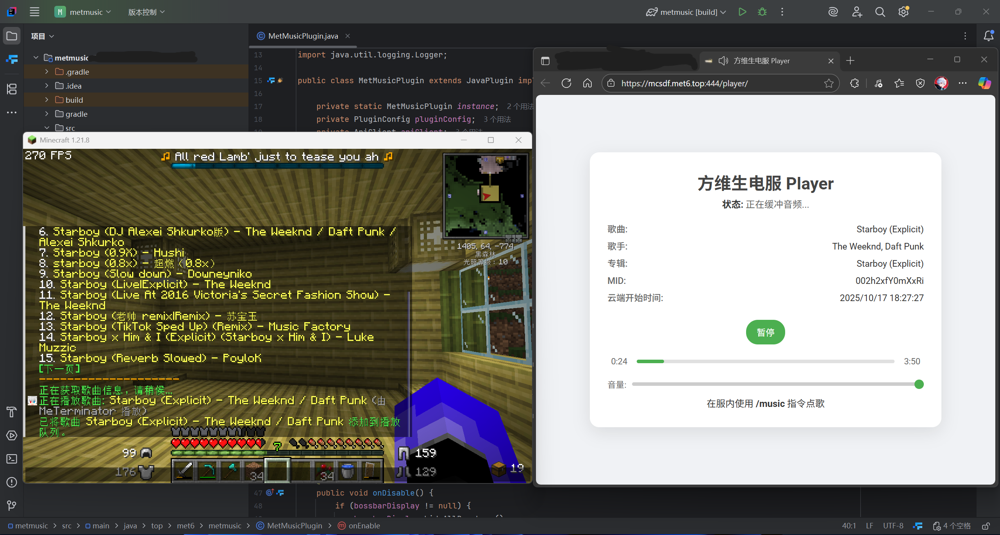

# MeT-Music_MCPlugin

> 仅供学习交流使用，严禁大规模宣传本项目，若流量过大，将考虑限制使用。

一个基于 Paper 的 Minecraft 服务器点歌/队列/歌词展示插件（服务端侧进度与歌词模拟，不向客户端推送真实音频）。



- **搜索与点歌**：通过指令搜索歌曲、按 MID 添加到播放队列
- **歌词与进度**：使用 BossBar 为全体在线玩家实时显示歌词与播放进度
- **歌单浏览与播放**：按歌单 TID 查看歌曲，支持按序号播放
- **播放控制**：继续/暂停、下一首、清空队列、设置播放进度
- **状态上报**：首次启动自动生成匿名会话 ID（sid），周期性上报播放状态

---

## 播放端

- 此插件并不负责客户端音乐播放，客户端音乐播放由额外的网页或播放器实现。具体代码将在后续开源。

## 兼容性与运行环境
- **服务器内核**：建议 Paper 1.20.x（`compileOnly io.papermc.paper:paper-api:1.20.1`，`api-version: 1.16` 对常见 Spigot/Paper 有较好兼容）
- **Java 版本**：Java 17（已在 `build.gradle` 设置 `sourceCompatibility/targetCompatibility`）

## 安装与快速开始
1. 从 Releases 下载或自行构建插件 jar。
2. 将 jar 放入服务器 `plugins/` 目录。
3. 启动服务器，插件会在 `plugins/MeT-Music/` 生成配置并分配 `sid`。
4. 进入游戏使用主命令 `/mmusic`（别名 `/music`）。

> 仅玩家可执行指令；控制台不可执行（见 `MusicCommand.onCommand()`）。

## 指令与用法
主命令：`/mmusic`（别名：`/music`）

- **帮助**
  - `/mmusic` 或 `/mmusic help` 或 `/mmusic 帮助`
- **按 MID 播放并入队**
  - `/mmusic playmid <mid>`
- **搜索歌曲**
  - `/mmusic search <关键字> [页码]`
  - 在结果列表中点击可直接添加至队列
- **播放搜索结果中的序号**
  - `/mmusic playsearch <序号>`（需先执行搜索）
- **查看歌单**
  - `/mmusic songlist <tid> [页码]`
- **播放歌单中的指定序号**
  - `/mmusic playsonglist <tid> <序号>`
- **播放控制**
  - `/mmusic play` 继续播放
  - `/mmusic pause` 暂停播放
  - `/mmusic next` 下一首
  - `/mmusic clear` 清空播放队列
  - `/mmusic setseek <秒数>` 设置播放进度（带范围校验）
- **信息与显示**
  - `/mmusic songinfo` 查看当前歌曲信息
  - `/mmusic setbossbar` 切换歌词 BossBar 显示状态（对自己）
  - `/mmusic sid` 查看并点击复制当前 SID，或点击打开播放器链接

Tab 补全：对一级子命令提供补全，并对部分参数给予提示。

## 配置
- 路径：`plugins/MeT-Music/config.yml`
- 首次启动自动写入：
  ```yml
  sid: <自动生成的UUID>
  player-url: 'https://music.met6.top:444/player/?sid={sid}'
  ```
- 说明：`sid` 为匿名会话 ID，用于播放状态上报；通常无需手动修改。`player-url` 可配置播放器地址，其中 `{sid}` 会自动替换为当前 SID。

## 外部接口与隐私说明
插件会访问以下接口（域名 `https://music.met6.top:444`）：
- 获取歌曲信息与时长：`/api/song/url/v1/?id=<mid>&level=hq`
- 获取歌词（LRC）：`/api/songlyric_get.php?show=lyric&mid=<mid>`
- 搜索：`/api/cloudsearch/?keywords=<encoded>&limit=<n>&offset=<n>&type=1`
- 歌单详情与曲目：`/api/playlist/detail/?id=<tid>`、`/api/playlist/track/all/?id=<tid>&limit=<n>&offset=<n>`
- 播放状态上报：`/api-collect/user_report/player_feedback_mcserver.php`

上报字段示例（见 `ApiClient.reportPlaybackStatus()`）：
- `event`：play/pause/progress
- `sessionId`：服务器匿名会话 ID（来自 `config.yml` 的 `sid`）
- `songMid`：歌曲 MID
- `status`：播放状态布尔值
- `currentTime`：当前进度（秒）
- `systemTime`：系统时间戳

如需停用上报或更换接口，请修改源码常量并自行构建。

## 构建与开发
本仓库已包含 Gradle Wrapper。

- **构建**
  ```bash
  ./gradlew build
  ```
  产物位于 `build/libs/*.jar`

- **本地测试运行**（需准备 Paper 服务端）
  `build.gradle` 使用了 `xyz.jpenilla.run-paper`：
  ```groovy
  tasks {
      runServer {
          minecraftVersion("1.20")
      }
  }
  ```
  启动本地测试服务端：
  ```bash
  ./gradlew runServer
  ```

- **主要源码结构**
  - 插件主类：`src/main/java/top/met6/metmusic/MetMusicPlugin.java`
  - 指令处理：`src/main/java/top/met6/metmusic/command/MusicCommand.java`
  - 播放管理：`src/main/java/top/met6/metmusic/manager/MusicPlaybackManager.java`
  - 歌词 BossBar：`src/main/java/top/met6/metmusic/bossbar/LyricBossbarDisplay.java`
  - 对外 API：`src/main/java/top/met6/metmusic/api/ApiClient.java`
  - 数据模型：`src/main/java/top/met6/metmusic/data/`
  - 插件清单：`src/main/resources/plugin.yml`（主命令 `mmusic`；别名 `music`）

## 贡献指南
- **讨论与问题**：请先在 Issues 中搜索，若没有重复再新建，附上详细复现步骤与日志。
- **开发环境**：JDK 17，推荐使用 IntelliJ IDEA。编码 UTF-8。
- **分支策略**：
  - 功能分支：`feature/<short-desc>`
  - 修复分支：`fix/<short-desc>`
- **提交规范**：推荐使用 Conventional Commits，例如：
  - `feat: 支持播放搜索结果序号`
  - `fix: 修复歌词进度越界导致的 NPE`
- **代码风格**：保持一致的 Java 风格，避免无意义的重排与格式化改动。
- **PR 要求**：
  - 描述改动动机与效果，截图或日志更佳
  - 关联相关 Issue（如有）
  - 新增/变更功能应同步更新 `README.md`
  - 通过基本构建与自测（`./gradlew build`、必要时 `./gradlew runServer`）

## 已知限制
- 不在客户端播放真实音频，仅基于歌词时间轴与 BossBar 做可视化。
- 需要外网访问 `music.met6.top:444`。
- 播放队列去重：相同 `mid` 不会重复入队。
- 搜索结果做了简易内存缓存（同关键词翻页复用）。

## 许可证
本项目使用 **MIT License** 开源，详见 `LICENSE`。

## 致谢
- Paper & Spigot 团队
- Gson（JSON 解析）
- 所有为本项目提出建议与贡献的朋友
